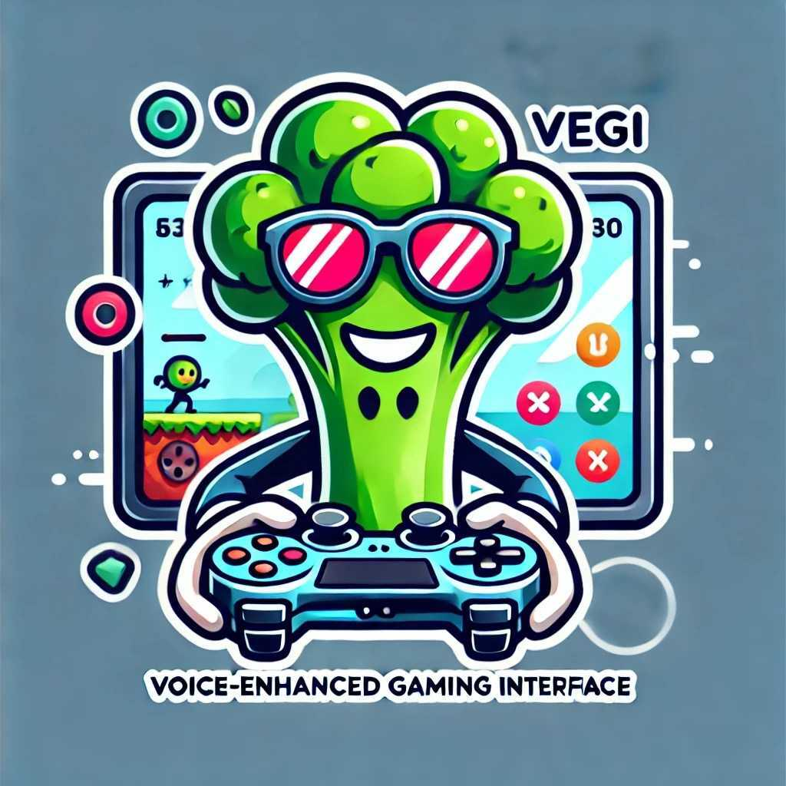

<div align="center" id="top"> 
  

  &#xa0;

  <!-- <a href="https://vegi.netlify.app">Demo</a> -->
</div>

<!-- 
<h1 align="center">VEGI (ˈve-jē') : Voice-Enhanced Gaming Interface</h1>

 <p align="center">
  

  

  

  

   

  

   
</p> -->

<!-- Status -->

<h4 align="center"> 
	🚧  Vegi 🚀 Under construction...  🚧
</h4> 

<hr>

<p align="center">
  <a href="#dart-about">About</a> &#xa0; | &#xa0; 
  <a href="#sparkles-features">Features</a> &#xa0; | &#xa0;
  <a href="#rocket-technologies">Technologies</a> &#xa0; | &#xa0;
  <a href="#white_check_mark-requirements">Requirements</a> &#xa0; | &#xa0;
  <a href="#checkered_flag-starting">Starting</a> &#xa0; | &#xa0;
  <a href="#memo-license">License</a> &#xa0; | &#xa0;
  <a href="https://github.com/{{YOUR_GITHUB_USERNAME}}" target="_blank">Author</a>
</p>

<br>

## :dart: About ##

The Voice-Enhanced Gaming Interface (VEGI) is an AI solution to provide real-time voice generation for various games. 

## :sparkles: Features ##

:heavy_check_mark: Feature 1;\
:heavy_check_mark: Feature 2;\
:heavy_check_mark: Feature 3;

## :rocket: Technologies ##

The following tools were used in this project:

- [Expo](https://expo.io/)
- [Node.js](https://nodejs.org/en/)
- [React](https://pt-br.reactjs.org/)
- [React Native](https://reactnative.dev/)
- [TypeScript](https://www.typescriptlang.org/)

## :white_check_mark: Requirements ##

Before starting :checkered_flag:, you need to understand the hardware you plan to run VEGI on. There is support for CPU, GPU, and AMD's NPU, with the last one requiring special drivers to be setup.


you need to have [Python 3.11](), and suggested to use a [Conda]() virtual enviorment.

[Git](https://git-scm.com) and [Node](https://nodejs.org/en/) installed.

## :checkered_flag: Starting ##

```bash
# Clone this project
$ git clone https://github.com/{{YOUR_GITHUB_USERNAME}}/vegi

# Access
$ cd vegi
```

CPU/GPU

```bash
# Install dependencies
$ python -m pip install requirements.txt
```

AMD's NPU
```bash
#Install dependencies
$ python -m pip install requirements-npu.txt

#Setup NPU drivers
$ setup.bat
```

Run
```bash
#Run with configurations
$ python vegi.py --device <CPU/GPU/NPU> 
```


NPU - Intall env for ryzenai-transformers (need to add steps here later) and run setup.bat from RyzenAI

CPU - Should work after fufilling pip dependencies

GPU - Needs to add cuda support 


Two paths:

OCR - Grab games dialogue from input coordinates, need to calibrate it for pokemon for AMD Contest. 

Overwolf - Grab chat data from Overwolf API and writes to a files and vegi read from it. Need to streamline data transfer or package vegi with overwolf app. 


Run sample-app by following https://overwolf.github.io/start/basic-app/sample-app (only tested with League of Legends chat)


## :memo: License ##

This project is under license from MIT. For more details, see the [LICENSE](LICENSE.md) file.


Made with :heart: by <a href="https://github.com/{{YOUR_GITHUB_USERNAME}}" target="_blank">{{YOUR_NAME}}</a>

&#xa0;

<a href="#top">Back to top</a>
